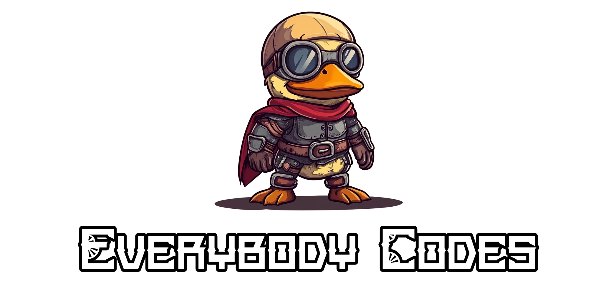

Welcome to my "Everybody Codes" repository! This repository contains my solutions to the Everybody Codes challenges.

To run the solutions, follow these steps:

1. Provide your own `input.txt` file. This input file is not shared in the repository due to Advent of Code's rules.
2. Use your preferred JavaScript runtime (TS-Node, Deno, etc.) to execute the file. All should work without any issues.

This repository is for educational purposes and to share my approach to solving the Advent of Code
challenges. Feel free to explore, modify, and use any code you find here for your own learning and
projects.

## 🏰️ [2024](https://everybody.codes/event/2024/quests) 

